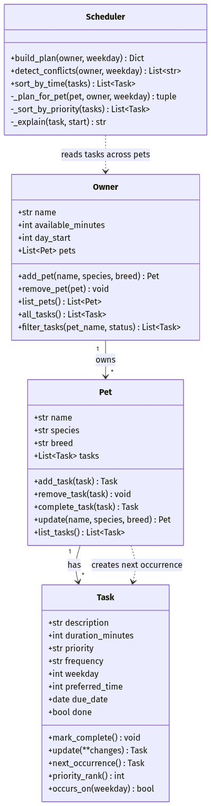

# PawPal+ (Module 2 Project)

You are building **PawPal+**, a Streamlit app that helps a pet owner plan care tasks for their pet.

## Scenario

A busy pet owner needs help staying consistent with pet care. They want an assistant that can:

- Track pet care tasks (walks, feeding, meds, enrichment, grooming, etc.)
- Consider constraints (time available, priority, owner preferences)
- Produce a daily plan and explain why it chose that plan

Your job is to design the system first (UML), then implement the logic in Python, then connect it to the Streamlit UI.

## What you will build

Your final app should:

- Let a user enter basic owner + pet info
- Let a user add/edit tasks (duration + priority at minimum)
- Generate a daily schedule/plan based on constraints and priorities
- Display the plan clearly (and ideally explain the reasoning)
- Include tests for the most important scheduling behaviors

## Getting started

### Setup

```bash
python -m venv .venv
source .venv/bin/activate  # Windows: .venv\Scripts\activate
pip install -r requirements.txt
```

### Suggested workflow

1. Read the scenario carefully and identify requirements and edge cases.
2. Draft a UML diagram (classes, attributes, methods, relationships).
3. Convert UML into Python class stubs (no logic yet).
4. Implement scheduling logic in small increments.
5. Add tests to verify key behaviors.
6. Connect your logic to the Streamlit UI in `app.py`.
7. Refine UML so it matches what you actually built.

## 🖥️ Sample Output

Terminal output from running the CLI demo (`python main.py`), which builds an
owner with two pets and demonstrates scheduling, sorting, conflict detection,
recurring tasks, and filtering:

```
====================================================
  Today's Schedule for Jordan
  Time budget: 120 min/pet, day starts 07:00
====================================================

🐾 Mochi (dog)
   07:00  Breakfast            (10 min) [high]
          ↳ High priority, placed early; honored preferred 07:00.
   09:00  Vitamins             (5 min) [high]
          ↳ High priority, placed early; honored preferred 09:00.
   18:00  Evening walk         (30 min) [medium]
          ↳ Medium priority; honored preferred 18:00.
   18:30  Enrichment puzzle    (20 min) [low]
          ↳ Low priority, filled in after the rest; wanted 14:00, moved to 18:30 to avoid overlap.

🐾 Biscuit (cat)
   09:00  Heart meds           (5 min) [high]
          ↳ High priority, placed early; honored preferred 09:00.
   09:05  Feed                 (10 min) [medium]
          ↳ Medium priority; wanted 08:00, moved to 09:05 to avoid overlap.

----------------------------------------------------
  Sorting demo: Mochi's tasks (added out of order)
----------------------------------------------------
  As entered:
     18:00  Evening walk
     07:00  Breakfast
     14:00  Enrichment puzzle
     09:00  Vitamins
  Sorted by time:
     07:00  Breakfast
     09:00  Vitamins
     14:00  Enrichment puzzle
     18:00  Evening walk

----------------------------------------------------
  Conflict detection demo
----------------------------------------------------
   ⚠️  Conflict at 09:00: Mochi's 'Vitamins', Biscuit's 'Heart meds' are all set for the same time.

----------------------------------------------------
  Recurring demo: completing a daily task
----------------------------------------------------
  Completing 'Breakfast' (frequency: daily)...
     Breakfast done: True
     Auto-created next occurrence 'Breakfast' due 2026-07-06 (today + 1 day)

----------------------------------------------------
  Filtering demo
----------------------------------------------------
  Pending tasks (not done):
     [ ] Evening walk
     [ ] Enrichment puzzle
     [ ] Vitamins
     [ ] Breakfast
     [ ] Heart meds
     [ ] Feed
  Completed tasks:
     [x] Breakfast
  Only Biscuit's tasks:
     Heart meds
     Feed

====================================================
```

Notice how each pet is planned in its own **parallel lane** (Biscuit's tasks
run alongside Mochi's), tasks are ordered by **priority**, preferred times are
honored where possible, and the two 09:00 tasks trigger a **conflict warning**.

## 🧪 Testing PawPal+

```bash
# Run the full test suite:
python -m pytest
```

The suite (22 tests in `tests/test_pawpal.py`) covers:

- **Sorting** — `sort_by_time()` returns tasks in chronological order and pushes
  tasks with no preferred time to the end of the day.
- **Recurrence** — completing a *daily* task spawns the next day, a *weekly* task
  the next week (+7 days), and a *once* task spawns nothing.
- **Conflict detection** — two tasks at the exact same preferred time warn; tasks
  at different times, completed tasks, and untimed tasks do not.
- **Scheduling / packing** — tasks within a pet lane never overlap, higher
  priority is placed first, and a task larger than the daily budget is skipped.
- **Edge cases** — empty owner, a pet with no tasks, and all-done pets plan
  cleanly without crashing.
- **Validation & CRUD** — invalid Task input is rejected; `Task.update()` /
  `Pet.update()` / `Owner.remove_pet()` edit and delete safely.

Sample test output:

```
============================= test session starts ==============================
collected 22 items

tests/test_pawpal.py::test_mark_complete_changes_status PASSED           [  4%]
tests/test_pawpal.py::test_adding_task_increases_pet_task_count PASSED   [  9%]
tests/test_pawpal.py::test_completing_daily_task_spawns_next_day PASSED  [ 13%]
tests/test_pawpal.py::test_once_task_does_not_recur PASSED               [ 18%]
tests/test_pawpal.py::test_sort_by_time_returns_chronological_order PASSED [ 54%]
tests/test_pawpal.py::test_tasks_in_a_pet_lane_never_overlap PASSED      [ 72%]
tests/test_pawpal.py::test_task_longer_than_budget_is_skipped PASSED     [ 81%]
tests/test_pawpal.py::test_completing_weekly_task_spawns_next_week PASSED [ 90%]
tests/test_pawpal.py::test_weekly_task_only_scheduled_on_its_weekday PASSED [ 95%]
tests/test_pawpal.py::test_task_rejects_invalid_input PASSED             [100%]

============================== 22 passed in 0.03s ==============================
```

**Confidence level: ★★★★☆ (4/5)** — every core behavior (sorting, recurrence,
conflict detection, budget-aware packing) and the main edge cases are covered and
green. Held back from 5/5 because the tests exercise the logic layer only; the
Streamlit UI wiring in `app.py` is verified manually, not automatically.

## ✨ Features

- **Manage pets and tasks (full CRUD)** — add, edit, and delete pets and care
  tasks from the browser; changes persist in-session, so you edit and re-plan
  without ever refreshing the page. (`Owner.add_pet` / `remove_pet`,
  `Pet.add_task` / `remove_task` / `update`, `Task.update`)
- **Priority-aware daily plan** — each pet gets its own back-to-back lane, ordered
  high → medium → low priority, respecting a per-pet time budget.
  (`Scheduler.build_plan`)
- **Sort by time** — view any pet's tasks in chronological order, with untimed
  tasks pushed to the end of the day. (`Scheduler.sort_by_time`)
- **Filter by pet or status** — list tasks for one pet, or only the done / pending
  ones. (`Owner.filter_tasks`)
- **Conflict warnings** — flags when two tasks are set for the exact same time so
  the owner can't be double-booked, shown as a live Streamlit warning banner.
  (`Scheduler.detect_conflicts`)
- **Recurring tasks** — completing a *daily* task auto-creates tomorrow's, a
  *weekly* task next week's (+7 days), and a *once* task nothing.
  (`Pet.complete_task` → `Task.next_occurrence`, using `timedelta`)
- **Explained placements** — every scheduled item carries a short reason ("High
  priority, placed early", "moved to 09:05 to avoid overlap"). (`Scheduler._explain`)

## 🏗️ Architecture (UML)

Four classes model the system: an **Owner** manages **Pets**, each **Pet** owns
**Tasks**, and the **Scheduler** is the "brain" that reads tasks across pets and
builds the daily plan. Completing a recurring Task makes its Pet create the next
occurrence.



Source: [`diagrams/uml_final.mmd`](diagrams/uml_final.mmd) (Mermaid). Regenerate the
PNG with:

```bash
npx -y @mermaid-js/mermaid-cli -i diagrams/uml_final.mmd -o diagrams/uml_final.png
```

## 📐 Smarter Scheduling

| Feature | Method(s) | Notes |
|---------|-----------|-------|
| Task sorting | `Scheduler.sort_by_time()`, `Scheduler._sort_by_priority()` | Chronological view by preferred time; planning orders by priority → time → duration |
| Filtering | `Owner.filter_tasks()`, `Scheduler.build_plan()` | Filter by pet name / completion status; planner skips tasks that exceed the per-pet time budget |
| Conflict handling | `Scheduler.detect_conflicts()`, `Scheduler._plan_for_pet()` | Warns on tasks sharing an exact preferred time; within a pet, tasks are placed back to back so they never overlap |
| Recurring tasks | `Pet.complete_task()`, `Task.next_occurrence()` | Completing a daily/weekly task auto-creates the next occurrence via `timedelta` (once = no repeat) |

## 🎬 Demo Walkthrough

### What you can do in the app

Run it with `streamlit run app.py`. The page has four areas:

- **Owner settings (sidebar)** — set the owner name, the daily time budget per
  pet, and when the care day starts.
- **1. Add a pet** — register a pet (name, species, breed). Each pet then appears
  in an expander where you can **edit** its details or **delete** it.
- **2. Add a care task** — attach a task to a pet (description, duration, priority,
  frequency, optional preferred time). Every task is editable and deletable in
  place, and can be marked complete.
- **3. Today's schedule** — click **Generate schedule** to build the plan; a live
  banner warns about time conflicts, an agenda table shows the sorted plan, and
  each pet's section explains why every task landed where it did.

### Example workflow

1. In the sidebar, set the budget to `120` min and day start to `07:00`.
2. Add two pets: **Mochi** (dog) and **Biscuit** (cat).
3. Give Mochi a `high`-priority "Breakfast" at 07:00 and a `low` "Enrichment
   puzzle" at 14:00; give Biscuit a "Feed" at 08:00. Add "Vitamins" to Mochi and
   "Heart meds" to Biscuit **both at 09:00** (a deliberate clash).
4. Click **Generate schedule**.
5. See a ⚠️ **conflict warning** for 09:00, an agenda **table** sorted by time,
   and each pet's lane packed with no overlaps — the low-priority puzzle is pushed
   later to make room, with a reason shown.
6. Edit or delete anything, click **Generate schedule** again — the plan updates
   without a page refresh.

### Key Scheduler behaviors shown

- **Sorting** — tasks entered out of order are shown earliest-first.
- **Priority packing** — high-priority tasks are placed first; nothing overlaps
  within a pet's lane.
- **Conflict detection** — same-time tasks raise a warning instead of crashing.
- **Recurrence** — completing a daily/weekly task spawns its next occurrence.

### Sample CLI output (`python main.py`)

```
====================================================
  Today's Schedule for Jordan
  Time budget: 120 min/pet, day starts 07:00
====================================================

🐾 Mochi (dog)
   07:00  Breakfast            (10 min) [high]
          ↳ High priority, placed early; honored preferred 07:00.
   09:00  Vitamins             (5 min) [high]
          ↳ High priority, placed early; honored preferred 09:00.
   18:00  Evening walk         (30 min) [medium]
          ↳ Medium priority; honored preferred 18:00.
   18:30  Enrichment puzzle    (20 min) [low]
          ↳ Low priority, filled in after the rest; wanted 14:00, moved to 18:30 to avoid overlap.

🐾 Biscuit (cat)
   09:00  Heart meds           (5 min) [high]
          ↳ High priority, placed early; honored preferred 09:00.
   09:05  Feed                 (10 min) [medium]
          ↳ Medium priority; wanted 08:00, moved to 09:05 to avoid overlap.

----------------------------------------------------
  Sorting demo: Mochi's tasks (added out of order)
----------------------------------------------------
  As entered:
     18:00  Evening walk
     07:00  Breakfast
     14:00  Enrichment puzzle
     09:00  Vitamins
  Sorted by time:
     07:00  Breakfast
     09:00  Vitamins
     14:00  Enrichment puzzle
     18:00  Evening walk

----------------------------------------------------
  Conflict detection demo
----------------------------------------------------
   ⚠️  Conflict at 09:00: Mochi's 'Vitamins', Biscuit's 'Heart meds' are all set for the same time.

----------------------------------------------------
  Recurring demo: completing a daily task
----------------------------------------------------
  Completing 'Breakfast' (frequency: daily)...
     Breakfast done: True
     Auto-created next occurrence 'Breakfast' due 2026-07-06 (today + 1 day)

----------------------------------------------------
  Filtering demo
----------------------------------------------------
  Pending tasks (not done):
     [ ] Evening walk
     [ ] Enrichment puzzle
     [ ] Vitamins
     [ ] Breakfast
     [ ] Heart meds
     [ ] Feed
  Completed tasks:
     [x] Breakfast
  Only Biscuit's tasks:
     Heart meds
     Feed

====================================================
```

*Optional: add screenshots of the Streamlit UI here for human reviewers.*
